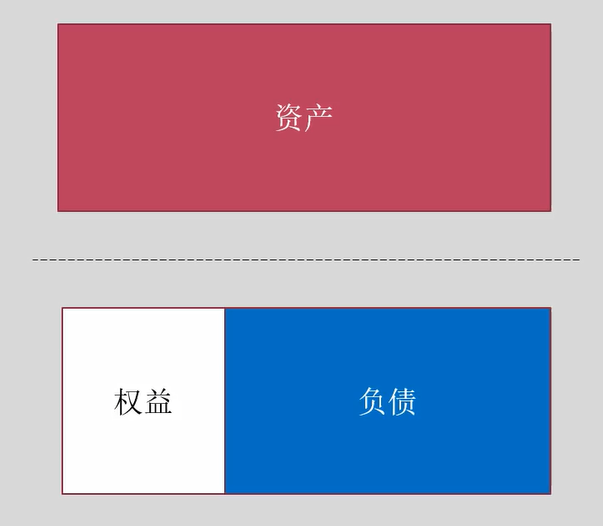
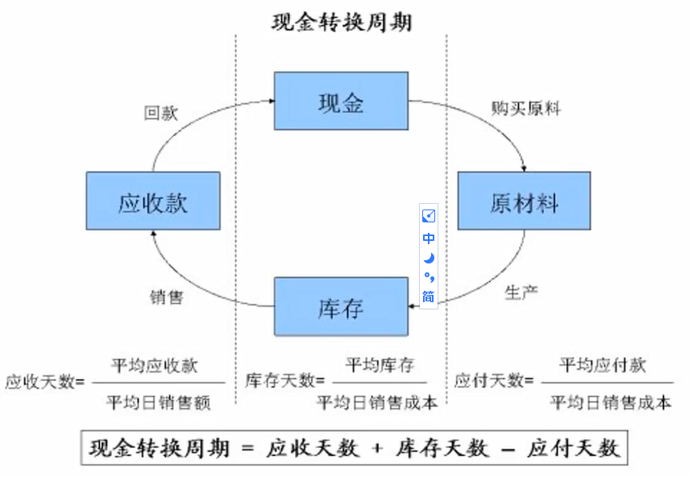
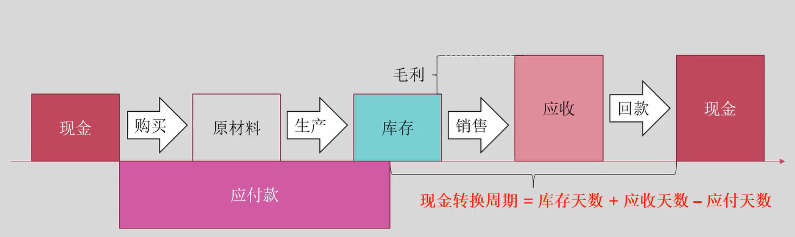

# 目录
[基本面分析](#基本面分析)

## 基本面分析

### 三张报表等
加、减、乘、除 就能解决
[资产负债表](#资产负债表)
[利润表](#利润表)
[现金流量表](#现金流量表)
[市场流动性分析](#市场流动性分析)
[返回目录](#目录)

---

#### 利润表：

经营、投资、筹资

&emsp;可以查看利润的来源，好生意应该大部分来源于**经营**

&emsp;可以查看**营业收入规模**，
* 老雷分析SFIX
* 营业收入**规模**17亿美元
* 营业收入**增长比率**20%。（需计算）
* 销售**毛利率**（需计算）

[返回](#三张报表等)

---

#### 资产负债表：

&emsp;&emsp;右转90°，权益+负债 撑起了 资产

&emsp;&emsp;相关指标：**资产负债率**（需计算），可以看到撑起资产的负债比例是多少，也可以算杠杆倍数（需计算）

上下游资产对库存的支撑：

应收（该收但没有收到的钱）

应付 和 预收（该付没付 和提前收的

库存

应付（上游的欠款）+预收（下游的预付款） > 应收 + 库存 
**说明**动用上下游资金维持运作。

现金占资产的比重

重资产、轻资产

&emsp;&emsp;Assets = Equity+Liabilities

[返回](#三张报表等)

---

#### 现金流量表

现金流，循环往复

[返回](#三张报表等)

---

#### 市场流动性分析

看多 和 看空 **期权持仓**

市场 **做空比率**

近期的 **成交量**

[返回](#三张报表等)

## Traindview

ICEUS: 搜索期货

## SFIX

* 时尚造型公司

* 问卷调查
  * 数据库 推荐算法 根据喜好、尺寸、预算 个性定制
* 加州 旧金山 8000员工 
  * 财报年收入 17亿 
  * 客户 340万
* 商业模式
  * 不生产衣服 根据算法搭配
  * 面向普通消费者 工薪阶层，收订阅费
  * 服装产业链最顶端：设计 或 **搭配**
  * 寄回去 
  * 服装个性化定制商 先发优势 既不生产（不是重资产），轻资产，技术驱动
  * 离终端用户近 引导客户消费取向
* 股权结构
  * 大股东都是谁（机构占比，机构占比）
  * 最大的个人股东
  * 管理层持股
  * 公共公司，大众持有，暴跌时候有机构增持
    * 年销售额
    * 收入增长 
    * 净利率 
    * 毛利率（30以上就是暴利了）
    * 研发投入47%（轻资产，技术驱动）
    * 运营中关注三大类数据
      * 应收账款
      * 应付账款（该付没付 & 预收的钱）
      * 库存（库存是投入，用上下游资金，维持自身运作）
    * 现金流
      * 现金占资产的比例
      * 净现金（懂财务的不会关注净利润的）
      * 支付利息的现金支出
    * 债务上
      * 负债率（21，不是特别高）
* 所属行业：互联网零售
* 市场的情况：
  * 流动性（成交额）：低点，中值
  * 总市值：不到30亿美元（对于17亿营业规模，和20%成长，属于合理）
  * 做空数据：Call，看多期权持仓量。Put，看空期权持仓量
    * 做空比例40%，轧空井喷行情
  * 图形：
    * 周线：17年上市，横盘
    * 日线推演：